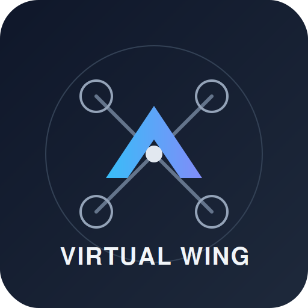

<p align="center">
  
</p>

<h1 align="center">Virtual Wing</h1>

<p align="center">
  A modular autonomous drone software framework, built from scratch to explore flight control, autonomy, and computer vision.
</p>

<p align="center">
  
  
  
</p>

---

## Overview

**Virtual Wing** is a personal, long-term engineering project focused on building the core software components of an autonomous drone from the ground up. Rather than relying on a single existing framework to provide flight autonomy out of the box, the project implements flight control interfacing, telemetry handling, mission execution, and computer vision as independent, understandable modules.

The primary goal of this project is depth of understanding — of drone software architecture, robotics concepts, MAVLink-based communication, and autonomous systems design — rather than solving a specific commercial or operational problem. Virtual Wing is developed incrementally, with new capabilities added as they are implemented and validated.

This is not a production-ready flight stack. It is an evolving codebase intended for experimentation, learning, and iterative systems design.

---

## Features

### Flight Control
- MAVLink communication via PyMAVLink
- Arm / Disarm sequencing
- Flight mode switching
- Takeoff and landing routines
- Return to Launch (RTL)

### Survey System
- Polygon-based survey area definition
- Lawn mower path generation
- Autonomous waypoint navigation
- Waypoint arrival detection
- Automatic RTL on survey completion

### Telemetry
- Heartbeat monitoring
- GPS position tracking
- Relative altitude
- Heading
- Ground speed
- Armed state
- Flight mode
- Centralized, shared drone state

### Computer Vision
- Camera streaming
- Multithreaded camera pipeline

### Architecture
- Thread-based concurrent design
- Dedicated telemetry thread
- Dedicated survey thread
- Dedicated vision thread
- Shared `DroneState` object for cross-thread state access

---

## Architecture Diagram

```
                         ┌───────────────────────────┐
                         │        Main Process       │
                         │   (Orchestration / Entry) │
                         └──────────────┬────────────┘
                                        │
        ┌──────────────────────────────┼──────────────────────────────┐
        │                              │                              │
┌───────▼────────┐           ┌─────────▼─────────┐          ┌─────────▼─────────┐
│Telemetry Thread│           │   Survey Thread   │          │   Vision Thread   │
│                │           │                   │          │                   │
│ - Heartbeat    │           │ - Waypoint Nav    │          │ - Camera Stream   │
│ - GPS / Alt    │           │ - Path Generation │          │ - Frame Pipeline  │
│ - Heading/Speed│           │ - Arrival Detect  │          │                   │
└───────┬────────┘           └─────────┬─────────┘          └─────────┬─────────┘
        │                              │                              │
        └──────────────┬───────────────┴──────────────┬───────────────┘
                        │                              │
                 ┌──────▼──────────────────────────────▼──────┐
                 │              Shared DroneState             | 
                 |                                            |    
                 │   (thread-safe state accessed by all       │
                 │    modules for coordination)               │
                 └──────────────────────┬─────────────────────┘
                                        │
                               ┌────────▼────────┐
                               │   MAVLink Link  │
                               │   (PyMAVLink)   │
                               └────────┬────────┘
                                        │
                               ┌────────▼───────────┐
                               │ ArduPilot SITL/    │
                               │ Flight Controller  │
                               └────────────────────┘
```

---

## Folder Structure

```
virtual-wing/
├── flight_control/
│   ├── connection.py
│   ├── arm_disarm.py
│   ├── modes.py
│   └── rtl.py
├── survey/
│   ├── polygon_survey.py
│   ├── path_generator.py
│   └── waypoint_nav.py
├── telemetry/
│   ├── telemetry_thread.py
│   └── drone_state.py
├── vision/
│   ├── camera_stream.py
│   └── vision_thread.py
├── core/
│   └── shared_state.py
├── examples/
│   └── run_survey_mission.py
├── docs/
│   └── assets/
├── tests/
├── requirements.txt
└── README.md
```

> Note: Folder structure reflects the current module organization and will evolve as new components are added.

---

## Installation

<details>
<summary><strong>Prerequisites</strong></summary>

- Python 3.10 or later
- ArduPilot SITL (for simulation testing)
- A MAVLink-compatible flight controller or simulator connection
- Use MAVProxy for better running environment

</details>

```bash
# Clone the repository
git clone https://github.com/tamilmani-2007/VirtualWing.git
cd VirtualWing

# Create and activate a virtual environment
python3 -m venv venv
source venv/bin/activate

# Install dependencies
pip install -r requirements.txt
```

---

## Usage

<details>
<summary><strong>Connecting to ArduPilot SITL</strong></summary>

```bash
# Start ArduPilot SITL in a separate terminal
sim_vehicle.py -v ArduCopter --console --map
```

</details>

```python
"""
Modules and implementations are available latter, this is still in the devolopment stage.
"""
```

Additional runnable examples  will be  in the [`examples/`](./examples) directory.

---

## Current Progress

| Module              | Status       |
|---------------------|--------------|
| MAVLink Connection  |  Implemented |
| Arm / Disarm        |  Implemented |
| Flight Modes        |  Implemented |
| Takeoff / Landing   |  Implemented |
| RTL                 |  Implemented |
| Telemetry Thread    |  Implemented |
| Polygon Survey      |  Implemented |
| Waypoint Navigation |  Implemented |
| Camera Streaming    |  Implemented |
| Object Detection    |  Planned     |
| Precision Landing   |  Planned     |
| Mission Logging     |  Planned     |
| Web Dashboard       |  Planned     |

---

## Roadmap

<details>
<summary><strong>Planned capabilities (click to expand)</strong></summary>

- [ ] YOLO-based object detection
- [ ] Multi-object tracking
- [ ] Image geotagging
- [ ] Precision landing
- [ ] Obstacle detection
- [ ] Mission recording
- [ ] Flight logging
- [ ] Mission replay
- [ ] Mission analytics
- [ ] Live dashboard
- [ ] Web-based control interface
- [ ] PX4 support (in addition to ArduPilot)
- [ ] AI-based navigation
- [ ] Autonomous search missions
- [ ] Terrain awareness
- [ ] Multi-drone coordination

</details>

Items are implemented opportunistically as time and interest allow. There is no fixed release schedule.

---

## Technologies Used

| Category              | Tools / Libraries        |
|-----------------------|--------------------------|
| Language              | Python                   |
| Vehicle Communication | PyMAVLink, MAVLink       |
| Simulation            | ArduPilot SITL           |
| Computer Vision       | OpenCV                   |
| Numerical Computing   | NumPy                    |
| Concurrency           | Python `threading`       |

---

## Design Principles

- **Modularity** — Each subsystem (flight control, survey, telemetry, vision) is implemented as an independent module with a clear responsibility.
- **Transparency over abstraction** — Core logic is implemented explicitly rather than hidden behind high-level framework calls, to support learning and debugging.
- **Incremental development** — Features are added one at a time, tested against simulation before being considered stable.
- **Shared state, isolated execution** — Threads operate independently but communicate through a single, well-defined shared state object rather than direct coupling.

---

## Development Status

Virtual Wing is under **active development**. It is a personal, long-term engineering project rather than a finished product, and its scope will continue to expand as new modules are implemented. Interfaces and internal structure may change as the project evolves.

---

## Future Work

Planned areas of exploration include perception (object detection and tracking), mission intelligence (logging, replay, analytics), and expanded autonomy (precision landing, terrain awareness, multi-drone coordination). See the [Roadmap](#roadmap) section for the full list of planned capabilities.

---

## Contributing

This is primarily a personal learning project, but suggestions, issue reports, and discussion are welcome. If you would like to contribute:

1. Fork the repository
2. Create a feature branch
3. Commit your changes with clear messages
4. Open a pull request describing the change and its motivation


---

## Contact

Maintained by **TAMILMANI M**.
For questions or discussion, feel free to open an issue on this repository.
